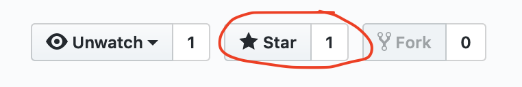

# Hacktivism

This is where Hacktivism course stuff goes.

## Where to start

If this is your first time using GitHub, you should go [create a new account](https://github.com/join) so you can then *star the repo* so that I'll know which GitHub users are in the class.

## What you can find in here

* [Syllabus](syllabus.md)
* [Some issues](https://github.com/dphiffer/hacktivism/issues)
	- [Readings](https://github.com/dphiffer/hacktivism/issues/1)
	- [Videos](https://github.com/dphiffer/hacktivism/issues/2)

## Why a GitHub repo?

[Igor Vamos](http://www.arts.rpi.edu/pl/faculty-staff/igor-vamos) taught this course before and used to post the syllabus as an editable Google Doc. I like the spirit of that, but I feel more at home in a text editor, and I'd like for the class to get familiar with GitHub as a site of where Hacktivism can happen.

## Hacktivism vs. Hactivism

The course seems to be listed in the RPI catalog as Hactivism (no K) and I like to spell it Hacktivism (with a K). I'm going to stick with my spelling, but I thought I'd call it out here.
